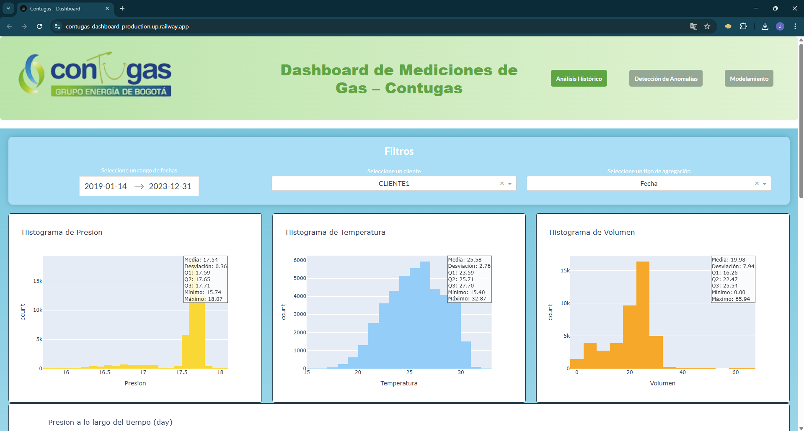
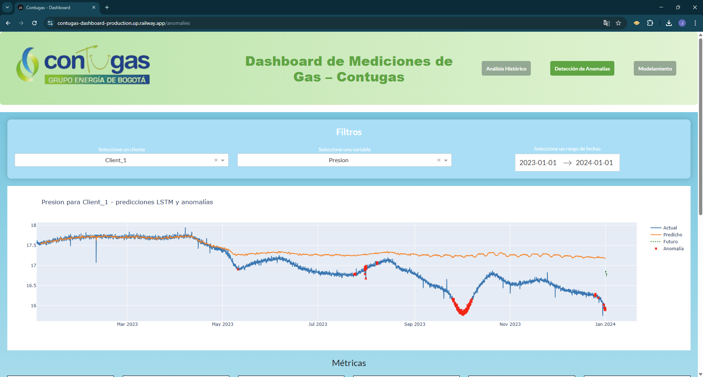
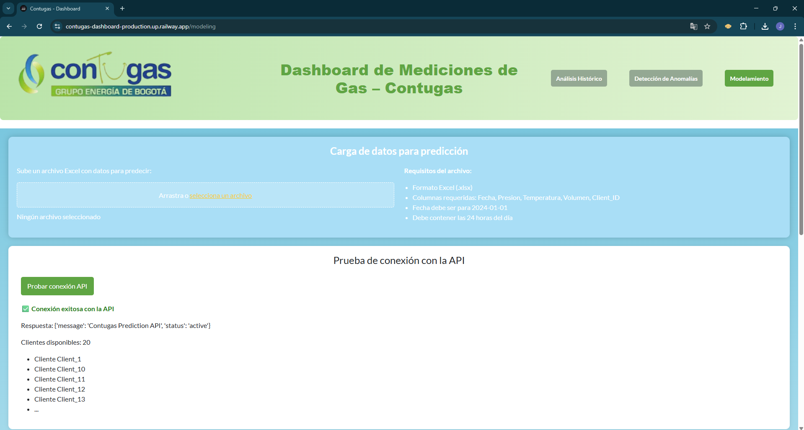

# Dashboard de Mediciones de Gas – Contugas

## Acceso rápido

- **Dashboard:** [https://contugas-dashboard-production.up.railway.app/](https://contugas-dashboard-production.up.railway.app/)
- **API (Swagger):** [https://contugas-dashboard-production-6acf.up.railway.app/docs](https://contugas-dashboard-production-6acf.up.railway.app/docs)

---

## Descripción general

Este proyecto es una solución integral para el análisis, modelamiento y visualización de datos de medición de gas de clientes de Contugas. Incluye un dashboard interactivo (Dash) y una API de predicción (FastAPI), junto con modelos LSTM preentrenados.

En la raíz encontrarás dos archivos PDF:

- **Manual_de_usuario.pdf:** Guía paso a paso para usuarios finales.
- **Presentacion_Empresarial.pdf:** Presentación ejecutiva del proyecto.

---

## Estructura del repositorio

```
├── app.py # Dashboard principal (Dash)
├── api.py # API de predicción (FastAPI)
├── layout1.py
├── layout2.py
├── layout3.py
├── requirements.txt # Dependencias del proyecto
├── lstm_models.pkl # Modelos preentrenados
├── data/
│ ├── Datos_Contugas_Compacted.csv
│ ├── predicted_with_anomalies_and_future.csv
│ ├── Errores.csv
│ └── Resultados_Modelos.csv
├── assets/
│ ├── ContugasBanner.png
│ ├── uniandes.png
│ ├── MIAD.png
│ ├── ss1.png # Screenshot Análisis Histórico
│ ├── ss2.png # Screenshot Detección de Anomalías
│ └── ss3.png # Screenshot Modelamiento
├── Manual_de_usuario.pdf
└── Presentacion_Empresarial.pdf
```


# Contugas Dashboard

## Instalación y Ejecución Local

### 1. Clona el repositorio
```bash
git clone https://github.com/JuanD13Perez/contugas-dashboard.git
cd contugas-dashboard
```

### 2. Instala las dependencias
```bash
pip install -r requirements.txt
```

### 3. Ejecuta primero la API
En una terminal:
```bash
python -m api
```
La terminal mostrará algo como:
```
Uvicorn running on http://0.0.0.0:8000
```
Accede a la API desde tu navegador en:  
[http://localhost:8000/docs](http://localhost:8000/docs)

### 4. Ejecuta el Dashboard
En otra terminal:
```bash
python app.py
```
La terminal mostrará algo como:
```
Dash is running on http://127.0.0.1:8050/
```
Abre esa dirección en tu navegador para acceder al Dashboard.

---

## Despliegue en Railway (Resumen)

1. **Crea dos servicios** en Railway desde el mismo repositorio:
   - **API**  
     Start command:
     ```bash
     gunicorn -k uvicorn.workers.UvicornWorker api:app
     ```
   - **Dashboard**  
     Start command:
     ```bash
     gunicorn app:server
     ```

2. **Expón ambos servicios** y genera sus dominios públicos.

3. **Configura la variable de entorno `API_URL` en el servicio del Dashboard:**  
   Ve a **Variables** y añade:
   ```
   API_URL=https://contugas-dashboard-production-6acf.up.railway.app
   ```
   (Reemplaza con la URL pública real de tu API)

4. Haz **redeploy de ambos servicios** si haces cambios.

---

## Tabs Principales del Dashboard

### 📊 Análisis Histórico
- Análisis de datos históricos con histogramas y series de tiempo.
- Permite filtrar por cliente, rango de fechas y tipo de agregación (hora, día, semana, mes, trimestre).



### 🚨 Detección de Anomalías
- Muestra resultados históricos del modelo LSTM y predicciones futuras.
- Visualiza anomalías detectadas por Isolation Forest.
- Incluye scores de anomalía, métricas detalladas y descripciones de los modelos.
- Tabla con anomalías recientes y explicación de cada modelo.




### 📈 Modelamiento
- Permite cargar un archivo Excel y mostrar predicciones basadas en el modelo LSTM histórico.
- Incluye un botón para testear la API directamente desde el dashboard.



---

## Documentación Adicional
Para descripciones de negocio y presentación empresarial, consulta los archivos PDF incluidos en la raíz del repositorio:
- `Manual_de_usuario.pdf`
- `Presentacion_Empresarial.pdf`

